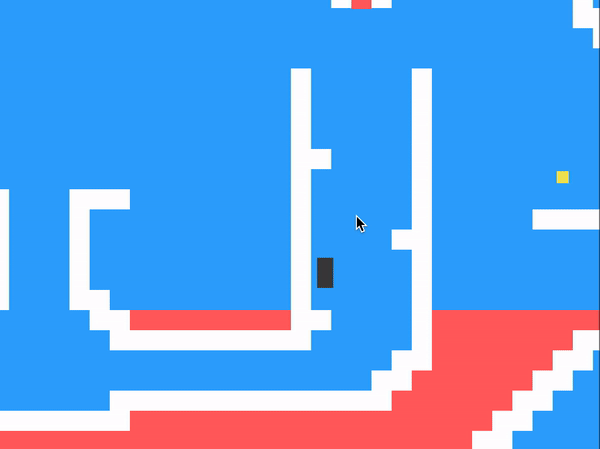
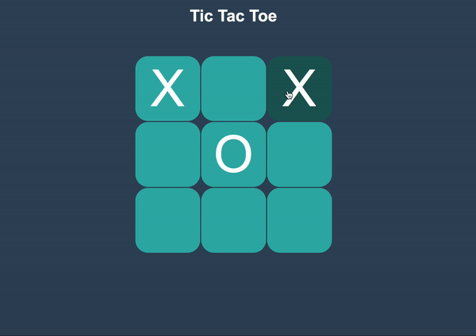

# JS Games

The purpose of this project is to experiment with animation using Javascript. 
Animations can be created with DOM elements, SVG images, or using the HTML
Canvas. These projects are built purely with HTML, CSS and JavaScript (No
Frameworks).

All games in this project have live demos (See below). But none of them are
mobile responsive.

## Games
1. [Basically Mario](#basically-mario)
2. [Tic-Tac-Toe](#tic-tac-toe)
3. [Wizards Hangman](#wizards-hangman)

## Basically Mario
This is a platform game similar to the classic arcade game Super Mario, based
on the Platformer project from Chapter 16 of Eloquent JavaScript.

[LIVE DEMO](https://skapoo01.github.io/jsGames/basicallyMario)

Features
1. Object Oriented Design and state management in JavaScript
2. DOM Manipulation w/ JavaScript
3. 8 awesome levels to play through

Future Directions
1. Improve graphics
2. Add a monster
3. Add music
4. High score board at the end

## Tic-Tac-Toe
Classic 2-player Tic-Tac-Toe game built with HTML Dom Manipulation.

[LIVE DEMO](https://skapoo01.github.io/jsGames/ticTacToe)

Features
1. Supports 2 players
2. DOM Manipulation w/ JavaScript
3. CSS Animations

Future Directions
1. Add single player mode

## Wizards Hangman
A twist on the classic Hangman game: put your Harry Pottr knowledge to the test.
Only true fans will conquer this game!

LIVE DEMO

Features
1. SVG image manipulation

Future Directions
1. Improve graphics
2. Add hints
3. Add high scores

## Games Wishlist
More classic games to experiment with, especially using HTML Canvas
1. Speed typing
2. Air Hockey
3. Asteroids
4. 2048
5. Flappy Bird
6. PacMan